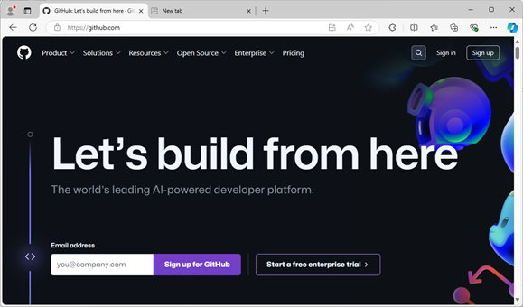
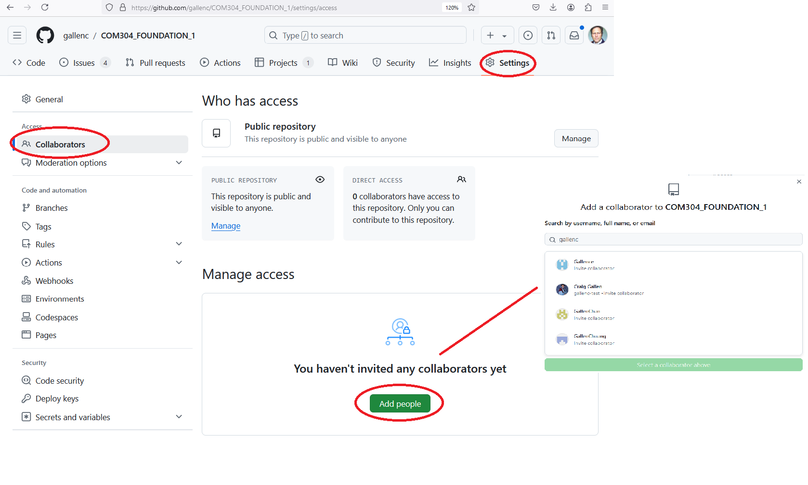

[Main Menu](../../sessions/README.md) | [session1](../session1/) 

# Session 1 

## Getting started with git

If you already have a github account, you can use that for this work.
If you do not already have a personal account you will first need to create a github account at [https://github.com](https://github.com)

   
   
This is your personal account which will live on after your university career.
Many employers look at personal github accounts of potential employees to understand what projects they have worked on and their level of skill.

Choose your github username wisely, it is unique and you will probably have to live with it for a long time :)

You can add personal details and a picture to your profile if you wish.
You don't have to use your university email for this account if you don't wish to. 
You may have to set up your mobile phone number and/or a personal authenticator app to allow 2 factor authentication.

Once you have set up your own account, you can `fork` the course examples repository.

Log into your own account using your username and password.

Navigate to the class examples `upstream` repository at [https://github.com/gallenc/COM304_FOUNDATION_1/](https://github.com/gallenc/COM304_FOUNDATION_1/)

Press the `Fork` button and follow any instructions to fork the repository into your own account.

   

This will create a `clone` (or copy) of the `upstream` repository in your own account. 

Navigate to your own cloned repository at https://github.com/_YOUR_USERNAME_/COM304_FOUNDATION_1/
(Where _YOUR_USERNAME_ is the username you chose for your github account)

This is your own copy which you can modify and use as your choose.
You cannot write to the `upstream` repository but you can write to this `forked` repo.

By default you will be creating a `public` repository, which means anyone can look at it (but not modify it). 
You could make this private and restrict access but we do not need to do this in this class.
(You will be creating your own personal learning record in this repo - but it will be easy to spot if this is not your own work when marking the submission)

You do want to make your tutor a collaborator on your project as this will allow him to track your progress 
(In future, if you are working together with another student on the same code, you may also want to make your partner a collaborator).

On the repository top page, select the `Settings` tab.

Select Collaborators and search for the username of the collaborator you are adding. 
Your tutor's username is `gallenc`.

   

## Starting a personal learning record / project diary.

A personal learning record is a requirement for the assessment. 
This can be completed using github markdown.

Github allows you to use a markup language called [Markdown](https://docs.github.com/en/get-started/writing-on-github/getting-started-with-writing-and-formatting-on-github/basic-writing-and-formatting-syntax) to write web pages and documentation.

Markdown is a simple formatting language which is easier to use than html.

All of the module material for this module has been written using markdown pages so there are plenty of examples in the class repo.

Github also allows you to create a separate wiki for documentation of your project using Markdown.
See [Documentation for Github wikis](https://docs.github.com/en/communities/documenting-your-project-with-wikis/about-wikis)

You could use the wiki feature if you choose, but a simple markdown template has also been provided within this repository for your personal learning record which will be enough for our purposes.

The template is already provided here [Personal Learning Record](../../myPracticeCourseWork/personal_learning_record/personal_learning_record.md)

You can edit the template directly in your browser by clicking on edit in the github page.

You can find formatting examples in the [Markdown Cheat Sheet](https://github.com/lifeparticle/Markdown-Cheatsheet)

It should be simple to navigate the learning record. 
You can add notes and personal reflections during and after each session.

For this week, you should fill in the student details and describe your prior learning.

---
**NOTE**

Your personal learning record MUST be your own work. 
You can reference code examples and work you have done collaboratively in class but each learning record should be in your own words.

---

## Creating a project plan

Github provides a useful project management capability which allows you to track progress of projects in your repositories. 

Full project documentation is provided in [Planning and tracking with Projects](https://docs.github.com/en/issues/planning-and-tracking-with-projects)

However since you will only be tracking your own work, you will only need a simple project.

A simple example of  project which is being used to track development of this module is here [COM304 Preparation](https://github.com/users/gallenc/projects/5) 

Start a project and use it to track your progress against tasks in this module.

A useful and active project plan is a requirement for the assessment.

## getting started with your Raspberry Pi

We will be using small single board computers called Raspberry Pi's to explore all aspects of computer architecture.

We will need to install an operating system and connect these PI's to the university wifi (eduroam).

See the instructions in [Installing Raspberry PI](../session1/docs/InstallingRaspberryPI.md)

You will work in pairs on these devices and you should label your PI so that you get the same one each week.

