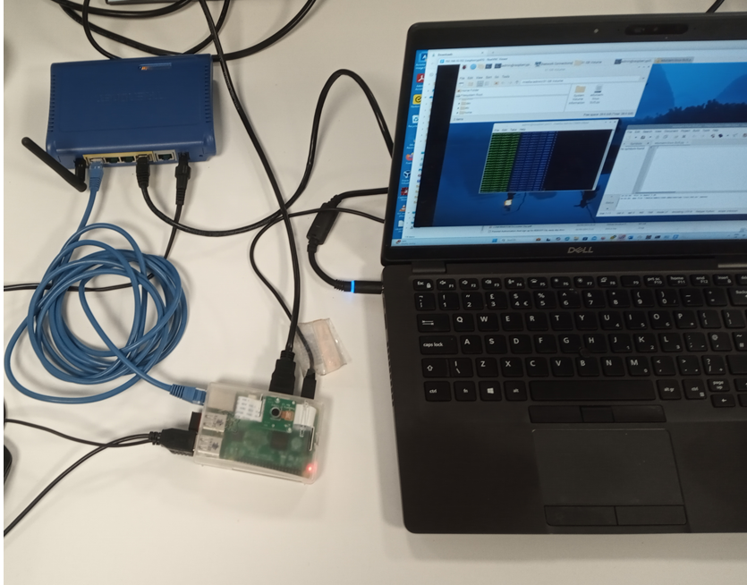
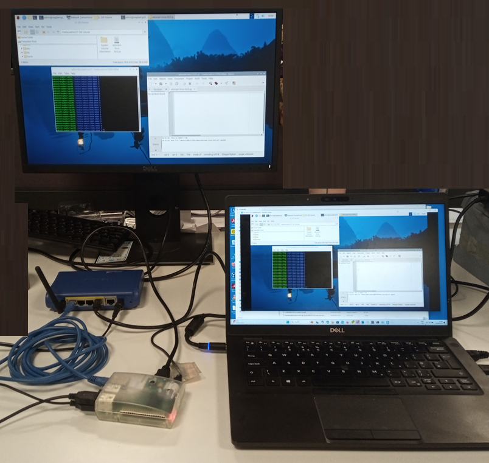

## Using SSH or VNC (more advanced)

As well as using eduroam it is also possible to use a wired connection to connect to your PI. 

In this setup a simple router is used to provide connectivity between the PI and the PC.

   

If the PI's Ethernet port is connected to a router, the Pi will use DHCP to obtain an IP address which will allow other devices to communicate with it. 

The only problem with this configuration is that the Pi will prefer the Ethernet eth0 port to the Wlan0 (wifi) port as the default route.

If you use the `route -n` command, you can see that the eth0 route will be used before the wlan0 and this can't be correct because only the wifi can see the internet.

```
admin@raspberrypi01:~ $ route -n
Kernel IP routing table
Destination     Gateway         Genmask         Flags Metric Ref    Use Iface
0.0.0.0         192.168.10.1    0.0.0.0         UG    100    0        0 eth0
0.0.0.0         10.79.192.1     0.0.0.0         UG    600    0        0 wlan0
10.79.192.0     0.0.0.0         255.255.224.0   U     600    0        0 wlan0
192.168.10.0    0.0.0.0         255.255.255.0   U     100    0        0 eth0

```
another similar command is `ip route`

```
admin@raspberrypi01:~ $ ip route
default via 192.168.10.1 dev eth0 proto dhcp src 192.168.10.102 metric 100 
default via 10.79.192.1 dev wlan0 proto dhcp src 10.79.192.115 metric 600 
10.79.192.0/19 dev wlan0 proto kernel scope link src 10.79.192.115 metric 600 
192.168.10.0/24 dev eth0 proto kernel scope link src 192.168.10.102 metric 100 
```
we need to delete the eth0 default route using

```
admin@raspberrypi01:~ $ sudo ip route del default dev eth0
```
and we can see that the eth0 default route is gone.

```
admin@raspberrypi01:~ $ route -n
Kernel IP routing table
Destination     Gateway         Genmask         Flags Metric Ref    Use Iface
0.0.0.0         10.79.192.1     0.0.0.0         UG    600    0        0 wlan0
10.79.192.0     0.0.0.0         255.255.224.0   U     600    0        0 wlan0
192.168.10.0    0.0.0.0         255.255.255.0   U     100    0        0 eth0

```
This will restore connectivity to the internet through the wifi.

Now that we have connetivity to the Pi we can use VNC or putty to view the screen from our PC. 
THis makes capturing images much easier.
(note in VNC settings you need to turn off 'pass special keys to vnc server' to be able to do a screen capture)

   


